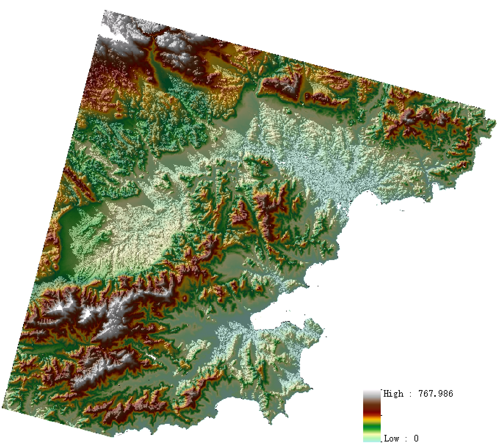

# REPMSatelliteStereo
The code of the paper **Refined equivalent pinhole model for large-scale 3D reconstruction from spaceborne CCD imagery**.

The original paper could be found [here](https://arxiv.org/abs/2310.20117) (Arxiv) and [here](https://doi.org/10.1016/j.jag.2024.104164) (Elsevier).

---
#### This work strongly borrows the insights from the previous VisSatSatelliteStereo approaches. More details in the *Acknowledge* part.

## Introduction

This project is inspired by previous work, namely [VisSatSatelliteStereo](https://github.com/Kai-46/VisSatSatelliteStereo). 


## How to use
This project mainly consists of three parts, which are image patrtion, image geometric correction and DSM calculation. 
Please refer to the [VisSatSatelliteStereo](https://github.com/Kai-46/VisSatSatelliteStereo) project for details of the SfM and MVS process.
### 1. Dataset
This project takes the ZY-3 image data of Sainte-Maxime provided by ISPRS as an example, the data could be dawnloaded [here](https://www.isprs.org/data/zy-3/Default-HongKong-StMaxime.aspx).

### 2. Image patrtion module
Large-scale images are processed by image patrtion module to obtain image blocks with suitable sizes, while small-scale images skip this procedure as their sizes are considered optimal. 
This process requires setting four parameters, the work path `Path`, the save path `SavePath`, the size of the image block `CropSize`, and the overlap rate between the image blocks `RepetitionRate`.

`python image_partition.py`

The `Path` must contain files in the following format:

```
image
 │   0001.tif
 │   0001.rpc
 │   ...
```

### 3. Image geometric correction module
The large-scale images are croppped into image blocks by image patrtion, 
and the folders `images` and `metas` are created to store the image blocks and their RPC parameters respectively.
Then the image geometric correction is performed.

`python image_correction.py`

The following files are saved in the `SavePath`:
```
SavePath
 │  Correction_Error.txt             # Reprojection error before and after image geometric correction
 │  Correction_parameter.json        # The parameters of the correction function
 │  enu_dict.json                    # The origin of the ENU local coordinate system
 │  perspective_enu.json             # Projection parameters after the RPC model is equivalent
 │  perspective_enu_error.csv        # Reprojection error after the RPC model is equivalent
 │  
 └─images
        0001_1.tif
        ...
```
The above `SavePath` can be input into the project [VisSatSatelliteStereo](https://github.com/Kai-46/VisSatSatelliteStereo) for SfM and MVS to generate depth maps.

### 4. DSM calculation
The results generated after the MVS of the project [VisSatSatelliteStereo](https://github.com/Kai-46/VisSatSatelliteStereo) process are as follows:
```
mvs
 │  depth_ranges.txt
 │  img_idx2name.txt
 │  inv_proj_mats.txt
 │  last_rows.txt
 │  proj_mats.txt
 │  raw_depth.txt
 │  ref2src.txt
 │  reference_plane.txt
 │  reparam_depth.txt
 │  
 └─stereo
     │  fusion.cfg
     │  patch-match.cfg
     │  
     ├─depth_maps
     │      0000_1.tif.geometric.bin
     │      0000_1.tif.photometric.bin
     │      ...
     └─normal_maps
            0000_1.tif.geometric.bin
            0000_1.tif.photometric.bin
            ...
```
The above file is set to the `MVSPath` of the DSM calculation; the `enu_dict.json` generated by the image geometric correction is set to `enuPath`; `AOIPath` is optional.
Finally, the DSM calculation is performed to generate DSM results.
`python DSM_calculation.py`

The DSM results generated are as follows:
```
dsm
  ├─aggregate_2p5d                     # DSM results for the whole region
  │      aggregate_2p5d.ply
  │      aggregate_2p5d_dsm.cbar.jpg
  │      aggregate_2p5d_dsm.jpg
  │      aggregate_2p5d_dsm.mask.jpg
  │      aggregate_2p5d_dsm.tif
  │      
  ├─dsm_fliter                # DSM results after intra-image elevation filtering
  ├─dsm_fliter_jpg              
  ├─dsm_img_grid              # Height grid maps for each image block
  ├─dsm_joint                 # DSM results after splicing the image blocks from the same perspective
  ├─dsm_jpg                   
  └─dsm_tif                   # DSM results for each image block
```

## Example

We provide the example of the reconstructed 3D scenes with our proposed method:



## Citation

If you find this work is helpful to your work, please cite:

```
@article{HONG2024REPM,
title = {Refined equivalent pinhole model for large-scale 3D reconstruction from spaceborne CCD imagery},
journal = {International Journal of Applied Earth Observation and Geoinformation},
volume = {134},
pages = {104164},
year = {2024},
issn = {1569-8432},
doi = {https://doi.org/10.1016/j.jag.2024.104164},
url = {https://www.sciencedirect.com/science/article/pii/S156984322400520X},
author = {Danyang Hong and Anzhu Yu and Song Ji and Xuanbei Lu and Wenyue Guo and Xuefeng Cao and Chunping Qiu},
}
```

## Acknowledgement
This work is supported by National Natural Science Foundation of China (No.42101458, No.42130112, No.42371459 and No.42201513).

This repository is MAINLY based on the [VisSatSatelliteStereo](https://github.com/Kai-46/VisSatSatelliteStereo) repository by Kai Zhang. Many thanks to Kai Zhang for the great project!
